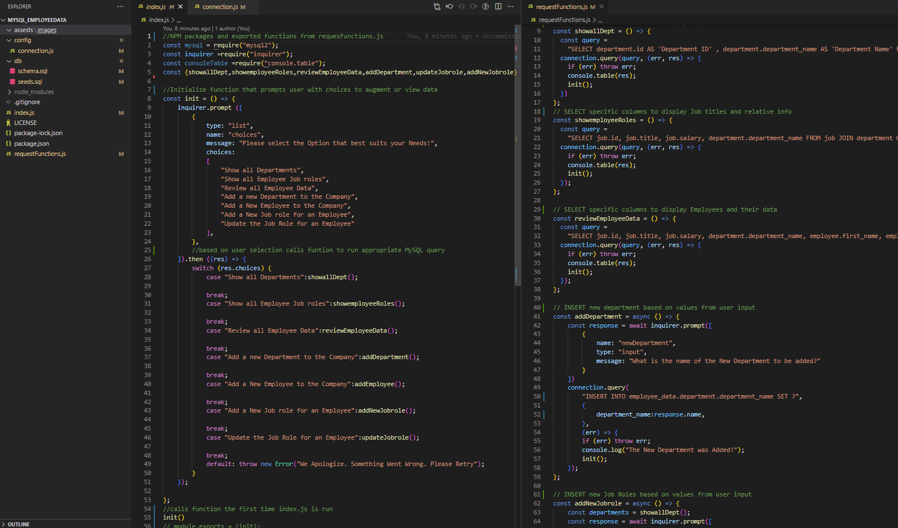

    
# MySQL_EmployeeData

## Table of Contents
* [Project Description](#description)
* [Installation](#install)
* [Contribution Notes](#contribution)
* [Usage Info](#usage)
* [Test Info](#test)
* [Contact Info](#contact)
* [Deployed Link](#deployed)
* [Screenshot](#screenshot)

## Description
A simple app that utilizes NPM packages fs, inquirer, and mysql2 to create and augment employee data in a database

## Install
NPM packages fs, inquirer, mysql, and a web browser with internet connection are required

## Contribution
please review package-lock.json

## Usage
NaN

## Test
NaN

## Contact
If you have any Questions or concerns please reach me via my E-mail or through GitHub  
rasvindra@hotmail.com  
[github.com/rasvindra](https://github.com/rasvindra)

## Deployed
https://youtu.be/WPqp2GHf-ZE

## Screenshot

